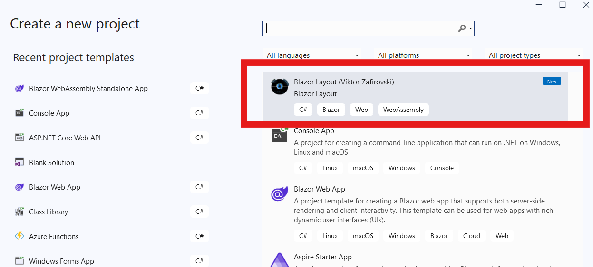

# Project2 parth of Blazor Template

- Example of how to set up and install your Blazor Project to display in Visual Studio.

## Displayed Your Project in Visual Studio

[Link to this project, now as a default project](https://github.com/vik37/your-blazor-project-as-new-project)
